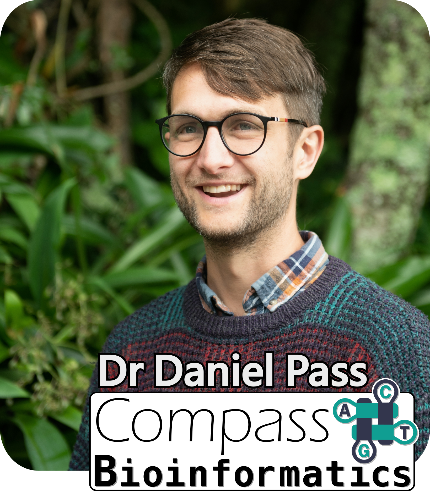

# Practical Python Programming for Biologists

Course written and delivered by Dr Daniel Pass ([Compass Bioinformatics](https://www.CompassBioinformatics.co.uk)).

These materials are designed for use in live training sessions and therefore have spaces where explanations, demonstrations, and solutions would be discussed and shown. Also there are supplementary presentations in a live course. If you're reading these materials outside of a course then please tweet me any feedback [@passdan](https://www.twitter.com/passdan)/[@CompassBioinf](https://www.twitter.com/CompassBioinf) and make me feel popular! If you're interested in joining a live course then please get in touch for upcoming ones.

## Overview 
This is a four-day course designed to provide an introduction to the Python programming language for all biologists and life scientists looking to begin or solidify their coding. The course is intended for biologists at all levels (students, researchers, postdocs, and even PIs and group leaders!) with little or no prior programming experience. The pace of the course will begin foundational and develop into more complex aspects, with lots of time dedicated to the practice of the concepts covered.

## Course design
There are a lot of coding courses in the world that show (dump) lots of information and concepts on new users where you read and write notes, become very good at copy/paste, and then forget 24 hours after the course finishes. This course is designed with time and space to practice the actual code concepts and become proficient at the fundementals, producing real and useful outputs together. Therefore hopefully making it more likely to be directly relevant for your research. It also means that in these materials there are some places where I leave an empty space, or give a project which should be challenging. It is designed to be hard and make you think and struggle! And then we will work together to solve issues, find solutions, and I will provide "perfect" answers.

This github is of course read-only so my recomendation is to open [Google Colab](https://colab.research.google.com/) and point it to this github repository to run and edit the notebooks yourself. However, any Jupyter environment will work.

# Schedule
## Day 1
- [Introduction, concepts, & data types](Day1/P34B-Day1-Introduction.ipynb)
- [Basic data types, first coding, & Data manipulation](Day1/P34B-Day1-DataTypes_and_Manipulation.ipynb)
- [Collections  - Lists & Tuples & Dicts oh my!](Day1/P34B-Day1-MoreDataTypes.ipynb)

[Project: Manipulating DNA sequences - Transcription Factor Binding](Day1/P34B-Day1-Project.ipynb)

## Day 2
- [Conditionals & loops](Day2/P34B-Day2-Loops.ipynb)
- [I/O handling](Day1/P34B-Day1-IO.ipynb)
- [Advanced string manipulation](Day2/P34B-Day2-AdvancedStrings.ipynb)
 
[Project: Messy data handling]()

## Day 3
- [Organising code with functions](Day2/P34B-Day2-Functions.ipynb)

[Project: Chipseq, bespoke file formats, and functional organisation](Day2/P34B-Day2-Project.ipynb)

- [Modules and libraries: BioPython, numpy, pandas](Day3/P34B-Day3-Modules-Biopython_and_Stats.ipynb)

[Project: Problem solving with objects - viral genomics](Day3/P34B-Day3-Project.ipynb)

## Day 4
- [Data visualisation packages (matplotlib/seaborn/plotly)](Day4/P34B-Day4-Data_visualisation_and_libraries.ipynb)

[Project: Create plots of genomic data and compute statistics](Day4/P34B-Day4-Project.ipynb)
- [Your code as command line programs & argparse](Day3/P34B-Day3-CLI_and_argparse.ipynb)
- [Coding in the age of ChatGPT and AI bots](Day4/P34B-Day4-ChatGPT_and_AIs.ipynb)

[Developing your-research project, Future directions and coding skills](Day4/)

## Supplementary
- [Classes and Object Oriented code](Day3/P34B-Day3-ClassesAndObjects.ipynb)
- [Comprehensions](Supplementary/P34B-Comprehensions.ipynb)
